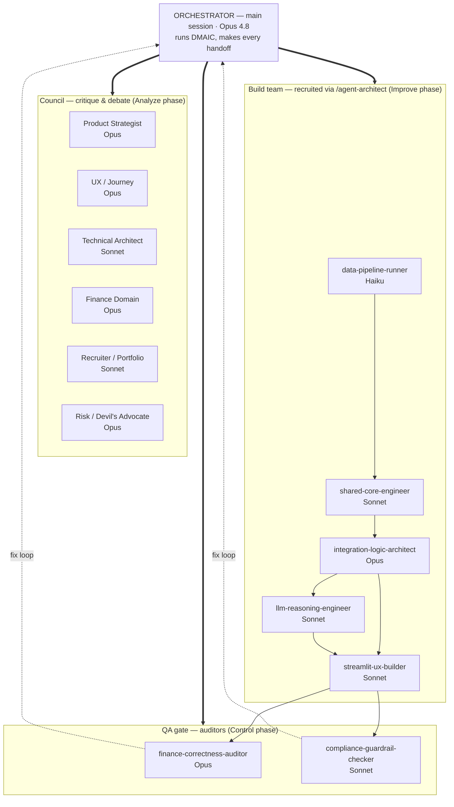
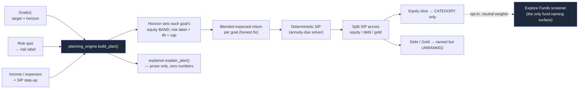

# TrueSIP — Workflow & Agent Hierarchy (graphical)

Two diagrams: **(1)** the Lean Six Sigma DMAIC process this product was built with, and **(2)** the agent hierarchy (orchestrator + council + build team + QA), with the model tier delegated to each role. Rendered in Mermaid so they display as real diagrams on GitHub.

---

## 1. The build workflow — Lean Six Sigma (DMAIC)

```mermaid
flowchart TD
    START(["Veer's ask: productize Projects 1 + 2 + 6 into one tool"]) --> DEF

    subgraph DEF["① DEFINE"]
        direction TB
        DEF1["Reframe the problem — not 3 apps to stack,<br/>but 1 journey with 2 manual seams"]
        DEF2["7 CTQs + Six-Sigma goal:<br/>2 handoffs → 0 · 3 entry points → 1 · LLM numbers stay 0"]
        DEF1 --> DEF2
    end

    subgraph ANA["② MEASURE / ANALYZE — Council debate"]
        direction TB
        ANA1["6 critics give independent positions (Round 1)"]
        ANA2["Chair synthesis: 5/6 build · 3 build mandates surfaced"]
        ANA3["Round 2 cross-examination:<br/>compliance resolved into a two-mode design"]
        ANA1 --> ANA2 --> ANA3
    end

    DEC{"③ Veer locks direction:<br/>Streamlit · goal-first · flagship-on-top ·<br/>name TrueSIP · lean core + Advanced"}

    subgraph IMP["④ IMPROVE — Build (model-delegated)"]
        direction TB
        IMP1["Recruit 7-agent team via /agent-architect"]
        IMP2["Data seed (Haiku) → shared core + scaffold (Sonnet)"]
        IMP3["Engine (Opus) → explainer (Sonnet) → UI (Sonnet)"]
        IMP1 --> IMP2 --> IMP3
    end

    subgraph CON["⑤ CONTROL — QA gate"]
        direction TB
        CON1["finance-correctness (Opus) ∥ compliance (Sonnet)"]
        CON2["ux-audit skill — browser-level UX gate"]
        CON3["fix loop until all gates PASS"]
        CON1 --> CON2 --> CON3
    end

    FIN(["Deploy · README · diagrams · distill the PROCESS_LOG into a skill"])

    DEF --> ANA --> DEC --> IMP --> CON --> FIN
```

---

## 2. The agent hierarchy

The **main session (Opus 4.8) is the orchestrator** — it runs DMAIC and sequences every other agent; none of the leaf agents invoke each other. Models are delegated by task complexity: **Haiku** = mechanical · **Sonnet** = standard build / fixed-criteria checks · **Opus** = heavy finance reasoning + judgment.

---

## 3. (bonus) The product's runtime data-flow — what the council made cohere

How a user's inputs flow through the merged engine. The point of the whole build: **0 manual handoffs**, every number deterministic, the LLM only explaining.

